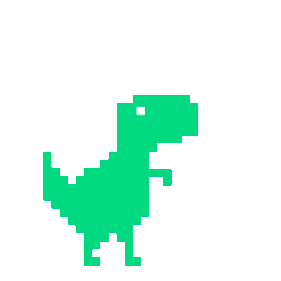
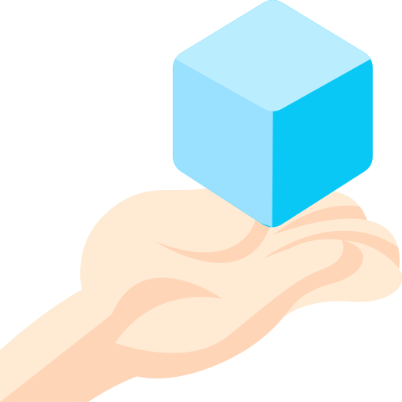

# Hello there! I'm Mojtaba Mirbaqeri 

### **About Me:**

- 🌱 I’m currently learning Vue.JS
- 📫 How to reach me [MojtabaMirbaqeri@gmail.com](mailto:MojtabaMirbaqeri@gmail.com)
- 😄 Pronouns: he / him / his

---

### ** Languages and tools:**

<table>
<tr>
<td></img> </td>
<td></img> </td>
<td></img> </td>
<td></img> </td>
<td></img> </td>
<td></img> </td>
<td></img> </td>
</tr>
</table>

---

### **Socials:**

<table>
<tr>
<td><a href="https://www.linkedin.com/in/mojtaba-mirbaqeri-1514022b1?utm_source=share&utm_campaign=share_via&utm_content=profile&utm_medium=android_app"></img></a> </td>
<td><a href="https://www.instagram.com/MojtabaMirbaqeri"></img> </a></td>
<td><a href="https://t.me/MojtabaMirbaqeri"></img></a> </td>
</tr>
</table>
